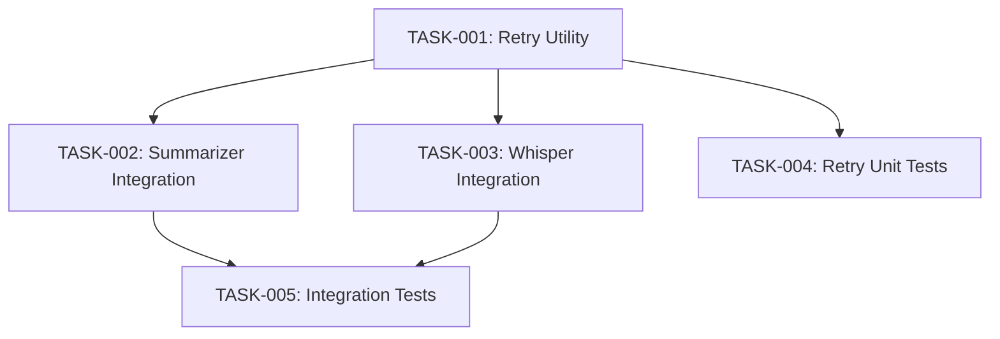

# BEAN-005: API Retry & Rate Limit Handling

## Metadata

| Field     | Value        |
|-----------|--------------|
| ID        | BEAN-005     |
| Title     | API Retry & Rate Limit Handling |
| Type      | enhancement |
| Priority  | P2 |
| Status    | Done         |
| Created   | 2026-02-10   |
| Started   | 2026-02-10 15:54 |
| Completed | 2026-02-10 16:01 |
| Duration  | ~7 min       |

## Problem Statement

All OpenAI API calls in `src/ai/summarizer.py` and `src/transcription/whisper_service.py` are fire-and-forget with no retry logic. If OpenAI returns a rate limit error (429), transient server error (500/503), or network timeout, the operation fails immediately with a cryptic error. Users must manually retry.

## Goal

API calls automatically retry with exponential backoff on transient failures, and show meaningful progress/error messages to the user.

## Scope

### In Scope

- Add retry wrapper with exponential backoff (3 retries, 1s/2s/4s delays)
- Handle HTTP 429 (rate limit), 500, 502, 503, timeout errors
- Log retry attempts at warning level
- Surface final failure as user-friendly error message
- Apply to both summarizer and transcription API calls

### Out of Scope

- Circuit breaker pattern
- Switching between API providers on failure
- Offline fallback for summarization

## Acceptance Criteria

- [x] Transient API errors (429, 500, 502, 503, timeout) trigger automatic retry
- [x] Retry uses exponential backoff (1s, 2s, 4s)
- [x] Maximum 3 retries before giving up
- [x] Each retry attempt is logged at warning level
- [x] Final failure produces user-friendly error message (not raw API error)
- [x] Retry logic is shared (not duplicated) between summarizer and whisper service
- [x] New tests cover retry behavior with mocked API responses

## Tasks

| # | Task | Owner | Depends On | Status |
|---|------|-------|------------|--------|
| 1 | Create shared retry utility module | developer | — | Done |
| 2 | Integrate retry into summarizer | developer | TASK-001 | Done |
| 3 | Integrate retry into whisper service | developer | TASK-001 | Done |
| 4 | Write tests for retry utility | tech-qa | TASK-001 | Done |
| 5 | Write integration tests for retry in services | tech-qa | TASK-002, TASK-003 | Done |

## Dependency Graph

## Telemetry

| Metric           | Value |
|------------------|-------|
| Total Tasks      | 5     |
| Total Duration   |       |
| Total Tokens In  |       |
| Total Tokens Out |       |

## Notes

No dependencies on other beans. Touches `src/ai/summarizer.py`, `src/transcription/whisper_service.py`, and possibly a new shared `src/utils/retry.py`.
