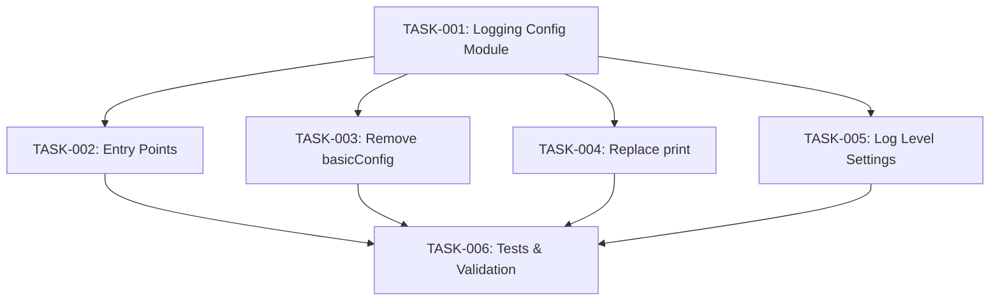

# BEAN-008: Consistent Logging Framework

## Metadata

| Field     | Value        |
|-----------|--------------|
| ID        | BEAN-008     |
| Title     | Consistent Logging Framework |
| Type      | enhancement |
| Priority  | P2 |
| Status    | Done         |
| Owner     | team-lead    |
| Created   | 2026-02-10   |
| Started   | 2026-02-10 15:54 |
| Completed | 2026-02-10 16:02 |
| Duration  | 8 min        |

## Problem Statement

Error reporting is inconsistent across the codebase:
- `src/transcription/whisper_service.py` uses `print()` for warnings (e.g., "OpenAI API key not configured")
- `src/config/settings.py` uses `logger.warning()`
- `src/gui/` modules use `QMessageBox` for some errors and silently swallow others
- Multiple modules call `logging.basicConfig()` independently (only the first call takes effect)
- No centralized logging configuration

## Goal

All modules use a consistent logging framework with a single configuration point, proper log levels, and structured output.

## Scope

### In Scope

- Create centralized logging configuration (called once in main entry points)
- Replace all `print()` warning/error calls with proper `logger.warning()`/`logger.error()`
- Remove duplicate `logging.basicConfig()` calls from individual modules
- Add file-based log output in addition to console
- Ensure GUI error dialogs are backed by log entries

### Out of Scope

- Log aggregation or remote logging
- Structured JSON logging
- Log rotation (keep it simple with single file)

## Acceptance Criteria

- [x] Single `logging` configuration in main entry points (`main.py`, `main_qt.py`)
- [x] All `print()` calls for warnings/errors replaced with `logger.warning()`/`logger.error()`
- [x] No duplicate `logging.basicConfig()` calls in individual modules
- [x] Logs written to both console and a log file
- [x] Log level configurable (DEBUG/INFO/WARNING in settings)
- [x] Existing tests still pass

## Tasks

| # | Task | Owner | Depends On | Status |
|---|------|-------|------------|--------|
| 1 | Create centralized logging config module | developer | none | DONE |
| 2 | Integrate logging into entry points | developer | 1 | DONE |
| 3 | Remove duplicate basicConfig() calls | developer | 1 | DONE |
| 4 | Replace print() with logger calls | developer | 1 | DONE |
| 5 | Add log level to settings | developer | 1 | DONE |
| 6 | Write logging tests & final validation | tech-qa | 1,2,3,4,5 | DONE |

## Dependency Graph

## Assignment Summary

| Persona   | Tasks |
|-----------|-------|
| developer | 5     |
| tech-qa   | 1     |

## Telemetry

| Metric           | Value |
|------------------|-------|
| Total Tasks      | 6     |
| Total Duration   |       |
| Total Tokens In  |       |
| Total Tokens Out |       |

## Notes

No dependencies on other beans. Touches all source files but changes are mechanical (print to logger). Low merge conflict risk since changes are on different lines than other beans.
